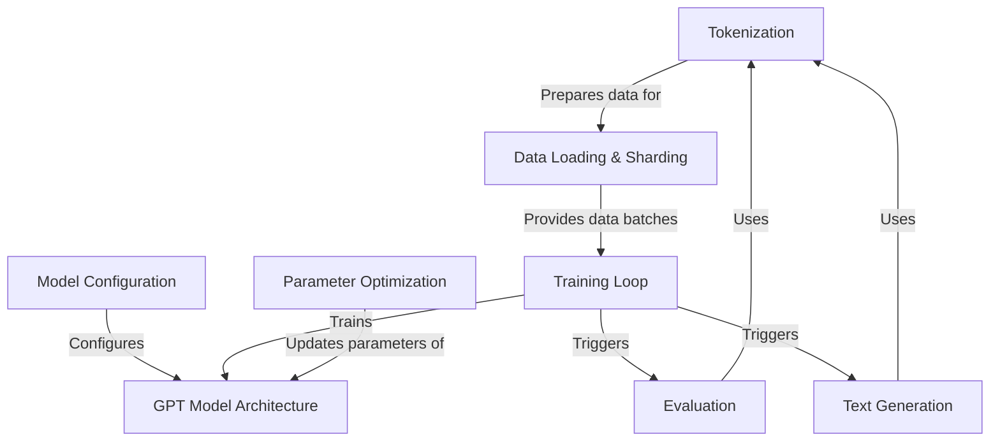

# Building GPT-2 from Scratch: A Transparent, Minimal Transformer on TinyShakespeare
## Overview
An end-to-end reimplementation of GPT-2 built from scratch using the TinyShakespeare dataset. Designed to expose every architectural and training detail of transformers, it offers a fully transparent, minimal yet production-faithful LLM pipeline.

  

## Objectives
- Build a GPT-2 architecture from scratch without high-level abstractions ✅
- Train on character-level data for full token traceability ✅
- Implement attention, residuals, layer norm, and optimizers from first principles ✅
- Support checkpointing and text sampling during training ✅
- Enable scientific understanding over performance optimization ✅

## Dataset
Name: TinyShakespeare  
Link: https://raw.githubusercontent.com/karpathy/char-rnn/master/data/tinyshakespeare/input.txt
- ~1MB of raw text (~1 million characters)
- Character-level data, plain .txt format
- Simple, overfit-friendly for quick iterations and visualization
- Ideal for learning dynamics and debugging transformer training

## Intuition
Traditional language model implementations prioritize performance and scale but often obscure core design logic behind heavy abstraction. This project tackles that by reconstructing GPT-2 from scratch, treating the model as a sequence modeling engine with full architectural visibility. The goal is not just to replicate outputs, but to internalize *why* transformers work.

This is approached by viewing next-token prediction as a left-to-right sequence generation task where:

* The **state** is the current token context,
* The **action** is the predicted next token,
* The **objective** is to minimize cross-entropy over billions of token steps.

We use a decoder-only transformer backbone because:

* It aligns with causal, autoregressive generation,
* Self-attention captures global context efficiently,
* LayerNorm before attention ensures stability during deep training.

Instead of abstract APIs, every layer—embedding, attention, feedforward—is built manually to expose gradients, shape flows, and training dynamics. Training is optimized using AdamW and cosine decay to reflect real-world schedules. Byte-level tokenization ensures robustness across languages while enabling compact vocabularies. This design gives you not just a model, but a foundation for scientific-level reasoning, debugging, and innovation in language modeling.

## Results
| **Metric**           | **Value**                                                                       |
| -------------------- | ------------------------------------------------------------------------------- |
| **Validation Loss**  | \~1.47 (after \~3 minutes on A100, 6-layer model)      |
| **Training Loss**    | Typically similar or slightly lower than val loss                               |
| **Tokens Processed** | \~300K total (dataset \~301,966 tokens split 90/10)                             |
| **Training Time**    | \~3 minutes on A100 GPU (`n_layer=6, n_embd=384`)                               |
| **Checkpointing**    | Configurable via `eval_interval`, defaults to saving on validation improvements |

## References
- Research Paper: https://cdn.openai.com/better-language-models/language_models_are_unsupervised_multitask_learners.pdf
- Tokenizer: https://github.com/openai/gpt-2
